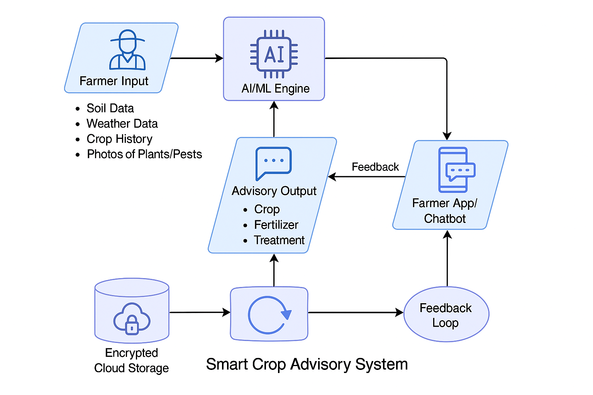

# Smart India Hackathon Workshop
# Date:27.09.2025
## Register Number:25015350
## Name:SASIKUMAR S
## Problem Title 
SIH 25010: Smart Crop Advisory System for Small and Marginal Farmers
## Problem Description
A majority of small and marginal farmers in India rely on traditional knowledge, local shopkeepers, or guesswork for crop selection, pest control, and fertilizer use. They lack access to personalized, real-time advisory services that account for soil type, weather conditions, and crop history. This often leads to poor yield, excessive input costs, and environmental degradation due to overuse of chemicals. Language barriers, low digital literacy, and absence of localized tools further limit their access to modern agri-tech resources.

Impact / Why this problem needs to be solved

Helping small farmers make informed decisions can significantly increase productivity, reduce costs, and improve livelihoods. It also contributes to sustainable farming practices, food security, and environmental conservation. A smart advisory solution can empower farmers with scientific insights in their native language and reduce dependency on unreliable third-party advice.

Expected Outcomes

• A multilingual, AI-based mobile app or chatbot that provides real-time, location-specific crop advisory.
• Soil health recommendations and fertilizer guidance.
• Weather-based alerts and predictive insights.
• Pest/disease detection via image uploads.
• Market price tracking.
• Voice support for low-literate users.
• Feedback and usage data collection for continuous improvement.

Relevant Stakeholders / Beneficiaries

• Small and marginal farmers
• Agricultural extension officers
• Government agriculture departments
• NGOs and cooperatives
• Agri-tech startups

Supporting Data

• 86% of Indian farmers are small or marginal (NABARD Report, 2022).
• Studies show ICT-based advisories can increase crop yield by 20–30%.

## Problem Creater's Organization
Government of Punjab

## Theme
Agriculture, FoodTech & Rural Development

## Proposed Solution

## Technical Approach
That techonolgy i use to develop this web application python,javascript for sturucture,node js.
1.Collect soil, weather, crop data.
2.Train AI/ML models.
3.Connect APIs (weather, market prices).
4.Build multilingual mobile app with voice/offline support

## Feasibility and Viability
Most farmers now have smartphones, and the app will collect sensitive data such as soil details, crop history, location, and user profiles.Multi-layered security (AES-256 for storage, TLS/SSL for data in transit) is widely supported by mobile platforms, making it technically feasible to implement.
1.Challenges:
Cloud and server breaches, though rare, are potential risks.
2.Overcome:
Use biometric login (fingerprint/face ID) for ease of use and security.
## Impact and Benefits
1.Scientific advice in local language, empowered farmers.
2.Reduced input cost, higher yield, better market access.
3.Sustainable soil & water use, reduced chemical misuse.
4.Promotes sustainable agriculture with balanced input use.
## Research and References
https://www.undp.org/sgtechcentre/sustainable-and-digital-agriculture-1